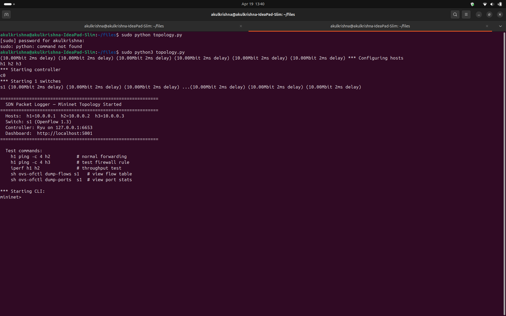
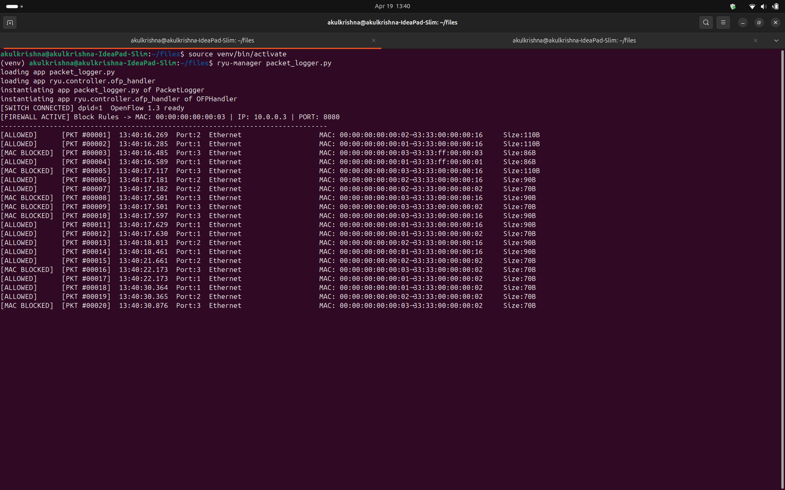
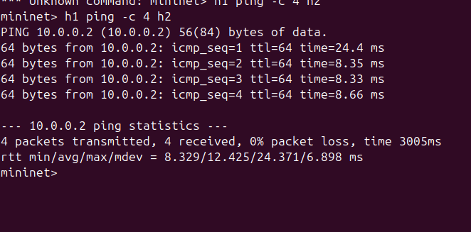
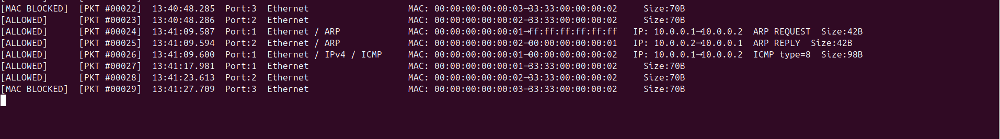
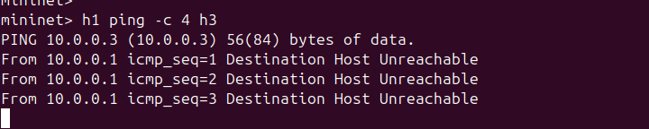
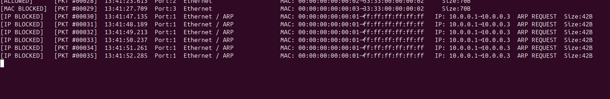
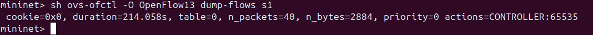
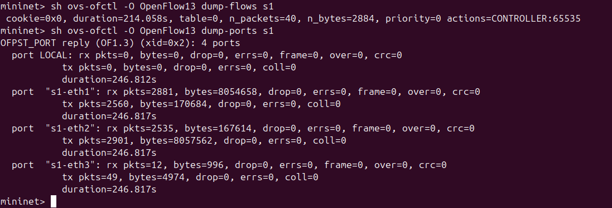
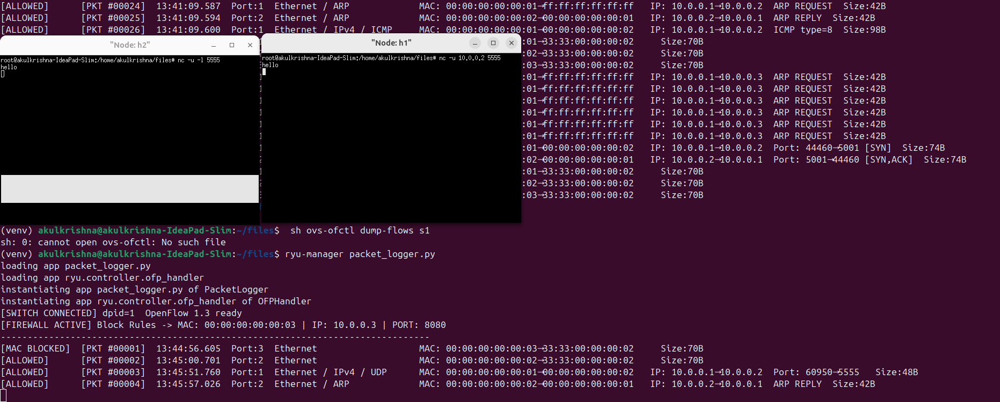
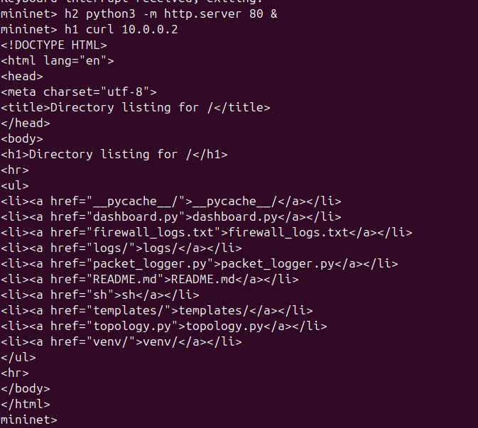

# NetworkLogger

> **Real-time SDN Packet Capture, Deep Inspection & Dynamic Firewall**
> Built with Ryu Controller + OpenFlow 1.3 + Mininet

---

## Problem Statement

Traditional network monitoring requires dedicated hardware probes. In Software-Defined Networking (SDN), the controller has global visibility of all traffic. This project exploits that visibility to:

- Capture and parse every packet traversing the network at Layer 2–4
- Identify protocol stacks: Ethernet → IPv4 → TCP / UDP / ICMP / ARP
- Implement L2 learning switch logic with proactive flow rule installation
- Enforce a **dynamic firewall** — block by MAC address, IP address, or Port number
- Log all decisions (ALLOWED / BLOCKED) instantly to terminal and `firewall_logs.txt`
- Perform Deep Packet Inspection (DPI) on TCP and UDP traffic

---

## Architecture

```
  [h1] ──┐
  [h2] ──┤── [s1  OVSKernelSwitch] ── OpenFlow 1.3 ── [c0  Ryu Controller]
  [h3] ──┘                                                      │
                                                        packet_logger.py
                                                    ┌───────────┴────────────┐
                                                  Logger               Firewall
                                               (all pkts)        (MAC / IP / Port)
                                                    │
                                             firewall_logs.txt
```

---

## Flow Rule Design

| Priority | Match | Action | Purpose |
|---|---|---|---|
| 100 | `ipv4_src=X, ipv4_dst=Y` | DROP | Firewall — hard block rules |
| 10  | `in_port=P, eth_dst=M`   | OUTPUT specific port | L2 unicast forwarding (learned) |
| 0   | wildcard (table-miss)    | CONTROLLER | Send all new packets up for logging |

Learned rules use `idle_timeout=10s` and `hard_timeout=30s` to keep the flow table clean.

---

## Features

- **L2 Learning Switch** — builds a MAC→port table per switch, installs unicast rules
- **Dynamic Firewall** — blocks by MAC address, IP address, or TCP/UDP port number
- **Deep Packet Inspection** — parses TCP flags (SYN/ACK/FIN/RST/PSH/URG), UDP ports, ICMP type/code
- **Packet Logger** — every packet logged with status, timestamp, protocol stack, addresses, size
- **Instant Log File** — all output written to `firewall_logs.txt` with zero buffer delay
- **Port Statistics** — view per-port rx/tx counts via OVS commands

---

## Project Structure

```
NetworkLogger/
├── packet_logger.py     # Ryu controller — logger + firewall + L2 switch
├── topology.py          # Mininet topology — 3 hosts, 1 switch
├── firewall_logs.txt    # Auto-generated — all packet decisions logged here
├── logs/
│   └── packets.log      # Secondary log file
└── README.md
```

---

## Setup & Execution

### Requirements

```
Ubuntu 20.04+ / Linux
Python 3.8+
Mininet 2.3+
Open vSwitch
Ryu SDN Framework
```

### Install Dependencies

```bash
# Mininet + Open vSwitch
sudo apt-get install mininet openvswitch-switch

# Python virtual environment (recommended)
python3 -m venv venv
source venv/bin/activate

# Ryu framework
pip install ryu
```

### Configure Firewall Rules

Edit the top of `packet_logger.py` before running:

```python
BLOCKED_MAC  = "00:00:00:00:00:03"   # Block h3 by MAC
BLOCKED_IP   = "10.0.0.3"            # Block h3 by IP
BLOCKED_PORT = 8080                   # Block TCP/UDP port 8080
```

### Run

**Terminal 1 — Start the Ryu controller:**
```bash
source venv/bin/activate
ryu-manager packet_logger.py
```

**Terminal 2 — Start the Mininet topology:**
```bash
sudo python3 topology.py
```

---

## Proof of Execution

### Step 1 — Topology started and Start the Ryu controller


Mininet launches with 3 hosts (h1=10.0.0.1, h2=10.0.0.2, h3=10.0.0.3) connected to switch s1.




---

### Step 2 — Ryu controller running + firewall active

Controller connects to s1, announces active firewall rules (MAC: `00:00:00:00:00:03`, IP: `10.0.0.3`, Port: `8080`). Packets from h3 are immediately tagged `[MAC BLOCKED]`, while h1 and h2 traffic is `[ALLOWED]`.


---

### Scenario A — Normal forwarding: `h1 ping -c 4 h2`

h1 and h2 can communicate freely. 4 packets sent, 0% packet loss, RTT ~8–24 ms.



Packets from host1 to host2 `[ALLOWED]`:



---

### Scenario B — Firewall blocking: `h1 ping -c 4 h3`

h3 is blocked at the IP level. All ping attempts return "Destination Host Unreachable".



The controller logs show `[IP BLOCKED]` for every ARP request trying to reach `10.0.0.3`:



---

### Scenario C — Flow table: `dump-flows s1`

Shows the table-miss rule (priority=0) forwarding all packets to the controller. After 40 packets processed, 2884 bytes handled.



---

### Scenario D — Port statistics: `dump-ports s1`

Per-port rx/tx packet counts confirm traffic distribution across the 3 host ports:
- `s1-eth1` (h1): rx=2881, tx=2560
- `s1-eth2` (h2): rx=2535, tx=2901
- `s1-eth3` (h3): rx=12, tx=49 ← very low, most traffic blocked



---

### Scenario E — Deep Packet Inspection: UDP traffic test

Using `xterm h1 h2` and `netcat` to send a UDP message. The controller correctly identifies the packet as `Ethernet / IPv4 / UDP`, logs source port `60950` → destination port `5555`, and the message "hello" appears in the h2 terminal. If `BLOCKED_PORT = 5555` were set, the packet would be dropped and the message would not arrive.



---
### Scenario F — Deep Packet Inspection: TCP HTTP traffic test

h2 runs a Python HTTP server on port 80. h1 uses `curl` to fetch the page. The controller captures the full TCP handshake — `[SYN]` from h1 and `[SYN,ACK]` reply from h2 — proving Layer 4 TCP flag inspection works correctly.

```bash
mininet> h2 python3 -m http.server 80 &
mininet> h1 curl 10.0.0.2
```

h1 receives the full HTML directory listing response from h2's HTTP server:



The controller logs the TCP handshake with flags — `Port: 38278→80 [SYN]` and `Port: 80→38278 [SYN,ACK]`:


If `BLOCKED_PORT = 80` were set in `packet_logger.py`, the curl request would be dropped and no response would arrive.

---


## Log Output Format

Every packet is logged to the terminal and `firewall_logs.txt` in this format:

```
[SWITCH CONNECTED] dpid=1  OpenFlow 1.3 ready
[FIREWALL ACTIVE] Block Rules -> MAC: 00:00:00:00:00:03 | IP: 10.0.0.3 | PORT: 8080
--------------------------------------------------------------------------------
[ALLOWED]      [PKT #00026]  13:41:09.600  Port:1  Ethernet / IPv4 / ICMP   MAC: 00:00:00:00:00:01→00:00:00:00:00:02   IP: 10.0.0.1→10.0.0.2  ICMP type=8  Size:98B
[MAC BLOCKED]  [PKT #00008]  13:40:17.501  Port:3  Ethernet                 MAC: 00:00:00:00:00:03→33:33:00:00:00:16   Size:90B
[IP BLOCKED]   [PKT #00030]  13:41:47.135  Port:1  Ethernet / ARP           MAC: 00:00:00:00:00:01→ff:ff:ff:ff:ff:ff   IP: 10.0.0.1→10.0.0.3  ARP REQUEST  Size:42B
```

Fields: `status | packet# | time | in-port | protocols | MAC src→dst | IP src→dst | extra | size`

---

## Test Commands (Mininet CLI)

```bash
h1 ping -c 4 h2                          # Scenario A: normal forwarding
h1 ping -c 4 h3                          # Scenario B: blocked by IP/MAC
sh ovs-ofctl -O OpenFlow13 dump-flows s1 # Scenario C: view flow table
sh ovs-ofctl -O OpenFlow13 dump-ports s1 # Scenario D: port statistics
xterm h1 h2                              # Scenario E: open terminals for UDP test
```

In h2 xterm:
```bash
nc -u -l 5555
```
In h1 xterm:
```bash
echo "Testing SDN UDP Logging" | nc -u 10.0.0.2 5555
```

---

## References

- Ryu SDN Framework: https://ryu.readthedocs.io
- OpenFlow 1.3 Specification: https://opennetworking.org/wp-content/uploads/2014/10/openflow-spec-v1.3.0.pdf
- Mininet Documentation: http://mininet.org/
- Open vSwitch: https://www.openvswitch.org/
